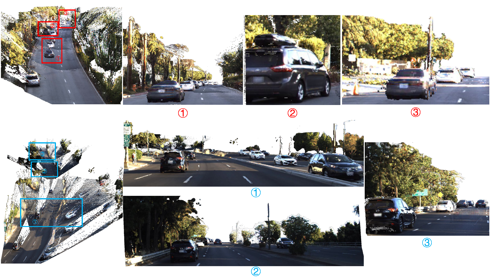

<h2>AFNet: Adaptive Fusion of Single-View and Multi-View Depth for Autonomous Driving</h2>
**CVPR 2024**

[Paper](https://arxiv.org/pdf/2403.07535.pdf)

This work presents AFNet, a new multi-view and singleview depth fusion network AFNet for alleviating the defects of the existing multi-view methods, which will fail under noisy poses in real-world autonomous driving scenarios.

