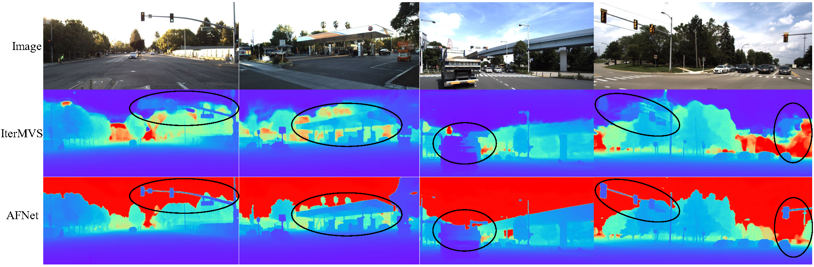

<div align="center">
<h2>AFNet: Adaptive Fusion of Single-View and Multi-View Depth for Autonomous Driving</h2>
<h2>**CVPR 2024**<h2>

[Paper](https://arxiv.org/pdf/2403.07535.pdf)
</div>

This work presents AFNet, a new multi-view and singleview depth fusion network AFNet for alleviating the defects of the existing multi-view methods, which will fail under noisy poses in real-world autonomous driving scenarios.


## ✏️ Changelog
### Mar. 20 2024
* Initial release. Due to the confidentiality agreement, the accuracy of the current reproduced model on KITTI is very slightly different from that in the paper. We release an initial version first, and the final version will be released soon.

## ⚙️ Installation

The code is tested with CUDA11.7. Please use the following commands to install dependencies: 

```
conda create --name AFNet python=3.7
conda activate AFNet
pip install -r requirements.txt
```

## 🎬 Demo



## ⏳ Training & Testing

We use 4 Nvidia 3090 GPU for training. You may need to modify 'CUDA_VISIBLE_DEVICES' and batch size to accommodate your GPU resources.

#### Training
First download and extract DDAD and KITTI data and split. 
Then run the following command to train our model. 
```
bash scripts/train.sh
```

#### Testing 
First download and extract data, split and pretrained models.

### DDAD:
run:
```
python eval_ddad.py --cfg "./configs/DDAD.conf"
```

You should get something like these:

| abs_rel | sq_rel | log10 | rmse  | rmse_log | a1    | a2    | a3    | abs_diff |
|---------|--------|-------|-------|----------|-------|-------|-------|----------|
| 0.088   | 0.979  | 0.035 |  4.60 |  0.154  | 0.917 | 0.972 | 0.987 | 2.042    |

### KITTI:
run:
```
python eval_kitti.py --cfg "./configs/kitti.conf"
```
You should get something like these:

| abs_rel | sq_rel | log10 | rmse  | rmse_log | a1    | a2    | a3    | abs_diff |
|---------|--------|-------|-------|----------|-------|-------|-------|----------|
| 0.044   | 0.132  | 0.019 | 1.712 | 0.069    | 0.980 | 0.997 | 0.999 | 0.804    |


#### Acknowledgement
Thanks to Zhenpei Yang for opening source of his excellent works [MVS2D](https://github.com/zhenpeiyang/MVS2D?tab=readme-ov-file#nov-27-2021)

## Citation

If you find this project useful, please consider citing:

```bibtex
@misc{cheng2024adaptive,
      title={Adaptive Fusion of Single-View and Multi-View Depth for Autonomous Driving}, 
      author={JunDa Cheng and Wei Yin and Kaixuan Wang and Xiaozhi Chen and Shijie Wang and Xin Yang},
      year={2024},
      eprint={2403.07535},
      archivePrefix={arXiv},
      primaryClass={cs.CV}
}
```


